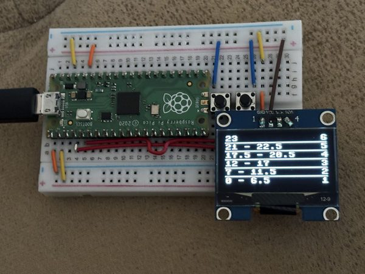
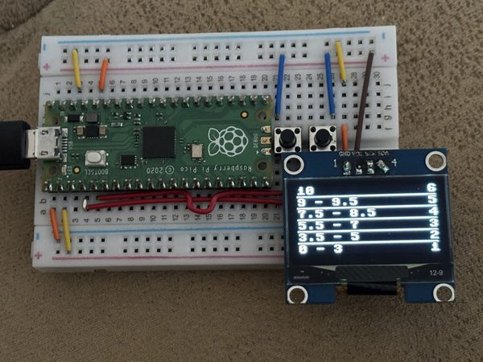
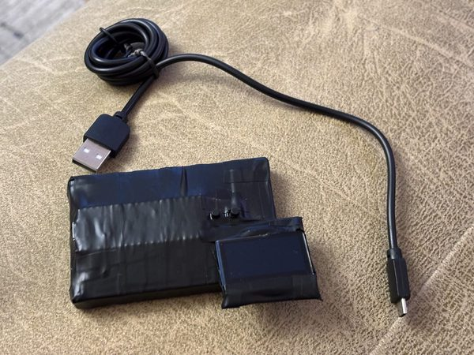
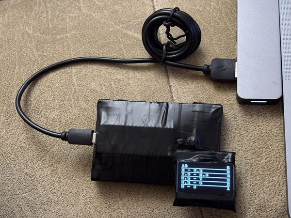

# 📘 Grade Range Calculator (MicroPython)

A simple MicroPython project that displays grade ranges on an OLED screen.  
Designed to help teachers quickly calculate and visualize student grades using easy button controls.  
**Made with love for my mum ❤️**

---

## 🖼️ Preview

### Prototype version

### Packed version

---

## 🧠 About the Project

This project uses a **MicroPython-compatible microcontroller** (e.g. Raspberry Pi Pico) and a **SH1106 OLED display** to show dynamically calculated grade ranges based on total points.  
Two physical buttons allow adjusting the total points, and the display instantly updates the corresponding grade intervals.

---

## ⚙️ Hardware

- Microcontroller: Raspberry Pi Pico (or compatible MicroPython board)
- Display: 1.3" OLED (SH1106, I²C)
- 2 × Push buttons (for increasing/decreasing points)
- Breadboard (for easy assembly)
- Short wires - the kind that fit snugly into the breadboard
- USB cable for power and programming
- Some electrical tape 😉

---

## 💻 Software

Built with **MicroPython** and designed to run directly on the microcontroller.  
The only external display-related dependency is the **SH1106 driver** used for the OLED screen.

Upload the project as `main.py` using **Thonny** or any other MicroPython-compatible IDE.

---

## ▶️ How to Use

1. Power the device via USB.  
2. Use the buttons to **increase** or **decrease** the total number of points.  
3. The OLED screen will automatically show updated grade ranges (from grade 1 to 6).  

---

## 🚀 Version 2.0

A new and improved version is planned.  
The next version will likely include a **rechargeable battery**, **lower power consumption**, and a **proper 3D-printed enclosure**.

---

## 💬 Inspiration

Created as a practical and heartfelt gift for my mum, a teacher who inspires learning every day.  
A small project with a big purpose ❤️
